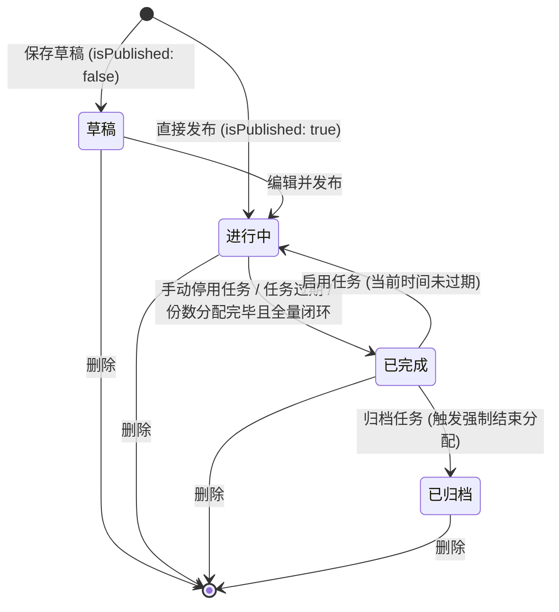
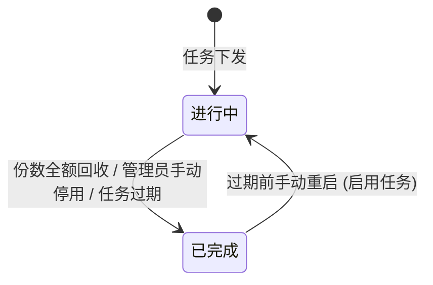
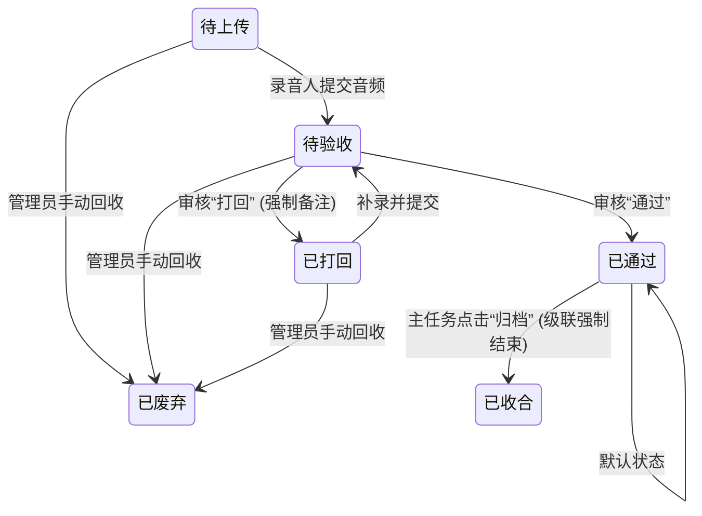

# 功能需求文档：任务管理服务

**功能分支**：`[task-management-001]`  
**创建时间**：2026-03-30
**状态**：初稿  
**输入**：“任务管理”功能

## 用户场景与测试 *(必填)*

### 用户故事 1 - 详尽的任务全景筛选与查询 (优先级: P1)

作为平台管理员或任务发起人，我希望能够在一个统一的列表大盘中监控所有类型的受控任务，并且可以通过输入模糊的任务名称/ID 或精确选择不同的筛选条件快速定位出指定的任务集合。

**优先级说明**：基于繁重的采集需求大盘，全景掌握各个业务侧分配下去的任务量和当前执行状态是基础监控诉求。

**独立测试**：该测试独立于任务新建或用户操作流程，专注于列表展示、分页加载与多维度动态查询。

**验收场景**：

1. **前提** 任务列表中存在大量进行中与已完成的任务，**当** 管理员使用搜索栏输入某个特定编号（如 `task-123`）或标题片段并结合“已完成”的状态筛选项，**则** 列表仅局部刷新展现对应结果行，且分页和数据显示正常。
2. **前提** 管理员已经执行了多次深层次过滤，**当** 点击“重置”按钮，**则** 所有筛选项应立即清空，并回归到默认无过滤状态下的最新全部任务。
3. **前提** 某音频采集任务包含极长的“需求方信息”，**当** 鼠标悬浮在该信息的截断处，**则** 会利用 Tooltip 浮窗完整加载显示该需求的全部描述内容。
4. **前提** 列表中存在“未发布”且状态为“草稿”的任务，**当** 管理员查看操作列，**则** 展示“编辑”和“删除”按钮，确保采集配置流程可回溯。

---

### 用户故事 2 - 标准化多步向导新建任务 (优先级: P1)

作为任务发起人，我希望通过一个结构清晰的多步骤向导表单（基础信息、指标用途、说明协议、录制词条），一步步地将复杂的业务诉求系统化地拆解并配置成一份标准的平台线上采集任务。

**优先级说明**：快速建立严谨、不可篡改且合法合规的采集标准（包含协议及文本集）是开始业务的唯一入口。

**独立测试**：新规任务表单自身校验严密性及独立成功发布流程的闭环验证。

**验收场景**：

1. **前提** 处于第一步“任务基础信息”配置页，**当** 未设置名称、任务结束时间或结束时间早于系统当前时间便试图点击“下一步”，**则** 系统将进行阻断并以红色文案明确反馈所需必填项和时间边界错误。
2. **前提** 到达“协议与说明”阶段，**当** 任务发起人分别上传了要求说明（支持 PDF/docx/MP4）或隐私申明的 PDF 文档，**则** 平台会保存上传记录并在后续采集者客户端强要求前置确认。
3. **前提** 完成了第一步“任务基础信息”配置，**当** 发起人在后续步骤（指标用途、协议、词条）中选择“保存草稿”而非直接发布，**则** 任务会被保存到列表，判定为“草稿”状态，可供以后继续编辑，且保存操作仅校验第一步的必填项。
4. **前提** 处于“音频详情”页，**当** 质检员对多条记录执行“批量通过”，**则** 对应记录的“验收情况”变更为“已通过”。
5. **前提** 处于“音频详情”页对特定录音执行“打回”，**当** 提交包含改进原因的备注，**则** 状态变更为“已打回”并推送至录音人端同步重录。
6. **前提** 处于“任务配置”页签，**当** 管理员修改了“发起人”或“采集说明”并导致内容变更，**则** 页面顶部立即浮现高亮的“配置已修改”确认条，且支持一键撤销所有未保存的改动。
7. **前提** 管理员将采集内容切换至“文件模式”并更换了新附件，**当** 点击保存，**则** 系统同步更新附件记录，并在后续采集任务中下发新的指导文件。

---

### 用户故事 3 - 任务状态机的高危流转控制 (优先级: P2)

作为任务审核或运营人员，为了应对采集市场的突发情况（如质检不达标严重、发现敏感隐私、任务标提前终止），我希望可以随时对目标任务实施停用（终止）、下架或归档锁定等强制动作。

**优先级说明**：任务不是发布后就无需管理的，它存在生命周期的中断风险和历史留存诉求。

**独立测试**：对于单条记录列表的独立状态修改与业务流转。

**验收场景**：

1. **前提** 一条状态正在“进行中”的任务，**当** 管理员点击了“停用任务”的敏感操作，**则** 界面触发一个警告性双重确认弹窗，确认后将任务流转至“已完成”态。
2. **前提** 某历史任务已完成处于“已完成”状态，**当** 业务方想归集数据，除了利用此列表重读详情外，还可以执行一键“归档”命令以彻底封存项目流水，且该状态下不包含重启入口。
3. **前提** 一条已被判定为无效的测试任务，**当** 管理员操作并二次确认“删除”操作，**则** 平台上将永久移除该记录。

---

### 用户故事 4 - 精细化音频质检与验收 (优先级: P1)

作为质检员或任务管理员，我希望能够精准定位每一条音频录音（通过 Rowkey 或文本），实时试听其回传效果，并能快速执行批量通过 or 打回操作，以确保入库音频的数据质量，并能追踪音频格式与采样率及更新时间。

**优先级说明**：数据质量是采集平台的核心价值，精细化的质检流程是保证数据可用性的关键。

**独立测试**：针对音频详情列表的试听、分享、批量质检及备注弹窗的逻辑验证。

**验收场景**：

1. **前提** 质检员勾选了多条“待验收”或“已打回”状态的音频记录，**当** 点击“批量确认通过”，**则** 弹出二次确认框，点击确认后所有选中记录状态瞬时变为“已通过”。
2. **前提** 某条音频存在环境噪音或录制不全，**当** 质检员点击操作列的“详情”进入并选择“打回”，**则** 系统强制要求填写“打回备注”，以便告知录音人改进点。
3. **前提** 业务方需要抽检特定格式的音频，**当** 在过滤栏输入“wav”并查询，**则** 列表精准过滤出符合采样率要求的样本。
4. **前提** 音频验收情况为“待上传”或“已废弃”，**当** 质检员查看列表行，**则** 音频 Rowkey 显示为“-”，且操作列中隐藏“试听”和“分享”操作。
5. **前提** 质检员需要按日期范围核查录音，**当** 在过滤栏使用“更新时间”选择器，**则** 列表展示特定日期区间的记录。
6. **前提** 质检员点击“分享”获取链接，**当** 链接生成并复制，**则** 提示“音频分享链接已复制，可供外部用户试听”，确保链接包含正确的 Rowkey。

---

### 用户故事 5 - 合规合法的隐私协议签署预览 (优先级: P2)

作为平台审计员或管理员，我希望能够随时查阅每位采集者签署的个性化隐私协议正文，包括其真实的电子手写签名、甲方信息以及明确的签署时间，以确保采集活动符合个人信息保护法的合规要求。

**优先级说明**：合规性证明是高质量数据入库的必要前置条件。

**独立测试**：隐私协议预览弹窗的展示完整性与排版合规性验证。

**验收场景**：

1. **前提** 采集者在客户端已完成签署动作（即状态非“未领取”），**当** 管理员点击“预览协议”，**则** 弹窗展示标准的法律文本，并能清晰看到乙方姓名、签署日期。
2. **前提** 定位到协议底部，**当** 查看签字区，**则** 系统仅展示录音人的“手写签名图片”及签署时间（不展示甲方盖章），且协议内容支持垂直滚动以便完整预览。

---

## 功能需求 *(必填)*

### 功能性需求

- **FR-001**: 任务大盘必须支持多条件组合式检索能力，至少覆盖：“任务标题/ID 模糊检索”、“指定发起人”、“录制类型(整份或定量)”、“任务用途与标签(测试/训练/调优)”、“任务处于的日期生命周期跨度(From-To)”与“任务状态”。列表默认按照 **“更新时间”** 倒序排列。在音频详情页，必须支持通过“日期范围选择器”对“更新时间”进行过滤。
- **FR-002**: 必须提供交互式的向导页面引导管理员新建复杂结构的任务（拆分成基础信息、指标用途、说明协议、录制词条4大步骤）。其中，“任务说明”部分必须支持 Markdown 文本编辑或文件式上传（PDF/docx/MP4），且文件上传需支持实时预览。在“录制词条”阶段，系统必须支持录制模式（整份/定量）的切换配置及预估份数的动态计算反馈，并支持对词条的高索管理。
- **FR-003**: 基于不同的任务“录制模式”（“定量录制”与“整份录制”）与“词条长度”（短词条/长词条），系统必须能够按相应约束对任务包的子拆分和执行模式进行控制。短词条模式支持移动端录制结束后的自动跳转切词；长词条模式必须支持采集过程中的“暂停/继续”能力，且切词需手动触发。
- **FR-004**: 针对特定的采集作业，发起人必须拥有开关选择能力决定该采集作业是否通过“代理人”发放（支持 `agentMode` 标志）。
- **FR-005**: 必须在任务下维护“录音人合规模版”要求，且“年龄”合规范畴不得直接写死，通过配置或独立协议下发进行用户提示与同意。
- **FR-006**: 在任务大盘界面，展示列必须包含：任务标题、任务ID、任务类型、录制类型、任务用途、预估份数、发起人、需求方信息、代理人模式、任务结束时间、是否发布、任务状态、**创建时间**、**更新时间**。
- **FR-007**: 在任务大盘界面，不同的任务状态必定渲染其合法的动作池（即“草稿”支持编辑与删除；“进行中”支持查看分发项、任务详情与停用；“已完成”支持查看详情、归档、删除、启用（若未过期）；已归档支持详情与删除），所有的破坏写操作（停用/删除/归档）均需执行前置警示二次确认。**特别注意**：执行“任务归档”操作时，若任务分配详情中仍有“进行中”的记录，系统将强制执行结束分配后进行归档，并弹出交互提醒告知用户。针对“未发布”的任务，操作列必须提供“编辑”入口以支持继续配置。
- **FR-008**: 系统必须能够实时维护各节点回收详情（代理人回收、人员回收），支持统计各代理点或个人的完成比例与通过率汇总。同一任务下的分片必须具备明确的“领取状态”与“回收状态”标识。
- **FR-009**: **音频质检辅助**: 必须提供音频详情页，展示 词条序号、Rowkey、语言、语速、录制文本、**识别结果**、**文本识别一致性**、音频格式及“验收情况”列。特别地，对于“待上传”或“已废弃”的记录，音频 Rowkey 需显示为“ - ”，且操作列中不提供“试听”和“分享”功能。对于“打回”的数据要更新备注。
- **FR-010**: **音频条目质检状态机**: 系统必须精细化管理每条音频记录的质检流转。核心状态包含：**待上传**（初始）、**待验收**、**已通过**、**已打回**、**已补录**、**已废弃**。具体跳转逻辑详见章节：[子任务音频状态机详情](#2-分配项音频条目回收状态机)。
- **FR-011**: **批量操作**: 必须支持对勾选的音频记录进行一键批量“确认通过”或“确认打回”，打回必须强制弹出备注框。特别地，系统必须限制复选框的勾选范围，仅允许对“待验收”和“已补录”状态的记录进行选择；对于“已通过”、“已打回”、“已废弃”及“待上传”状态，复选框应处于禁用态。
- **FR-012**: **隐私协议预览**: 系统必须支持预览用户签署的协议书，包含以下内容：
    - 协议书标题（如《隐私协议》）。
    - 明确的乙方（采集者）签署姓名及签署时间。
    - 标准合规的法律条款正文（滚动区域展示）。
    - 底部专用签字区：仅展示录音人的电子手写签名图片，并在此区域上方标注“乙方签名：”。
- **FR-013**: **批量辅助备注**: 在子任务执行详情中，支持通过翻页选择后的批量备注功能。勾选记录后，顶部动作栏应激活“批量添加备注”按钮，提交后即时覆盖所有选中项的备注内容。
- **FR-014**: **筛选状态持久化**: 当管理员在任务列表或音频详情列表执行筛选、搜索及翻页后，进入下级页面（如进入音频详情或返回上一级），返回时原有的筛选条件与分页状态 must得以完整保留。
- **FR-015**: **人员分配硬性约束**: 在非代理任务分配中，必须支持选择具体录音人，且已选录音人的总数不得超过该分配项设置的“预计录制音频份数”。系统须执行实时拦截与提示。
- **FR-016**: **代理模式交互精简**: 针对代理任务，分配弹窗应隐藏“预计录制人数”输入及“选择录音人”交互。系统默认基于“份数”进行指标预览，参与人由代理线下自行统筹。
- **FR-017**: **跨页数据状态同步**: 子任务执行详情页的“转派”操作必须具备副作用处理能力，自动更新并映射至父级分配记录中的 `selectedPersonIds` 名单，确保全局数据链路一致。
- **FR-018**: **隐私合规脱敏**: 人员选择与分配列表中的录音人联系方式（手机号）必须进行中间 4 位隐藏处理（如 `138****8888`）。
- **FR-019**: **人员选择智能排序**: 分配录音人弹窗再次打开时，必须将该计划下“已选择的人员”自动置顶展示，优化高频修改体验。
- **FR-020**: **日期解析鲁棒性**: 系统必须兼容并正确解析多种日期字符串格式（如 `-` 或 `/` 分隔符），确保在编辑旧数据时不会因日期格式异常导致页面崩溃（RangeError）。
- **FR-021**: **即时业务统计与人效看板**: 任务详情页必须提供“任务结果统计”页签，支持即时计算并展示以下维度指标。各指标统计口径与计算方式定义如下：
    - **1. 宏观进度维度 (Macro Progress)**
        - **已回收份数进度**: `已收集音频份数 / 任务预估总份数`。
        - **音频上传率**: `已上传音频词条数 / 任务总词条规模`。
        - **验收通过率**: `已验收通过词条数 / 任务已领取/已分配总词条规模`。
    - **2. 全链路流程监控 (Workflow Lifecycle)**
        - **分配覆盖率**: `已分配到代理或个人的预计份数 / 任务总预估份数`。用于衡量资源下发的饱和度。
        - **人员激活率**: `已开始产生有效录制（已上传）条数的人数 / 已分配的总人数`。用于识别分配后的真实活跃情况。
    - **3. 人效产出维度 (Efficiency)**
        - **平均 TPH (Terms Per Hour)**: `该分配项下回收的已完成词条总数 / 录音人在此任务上的累计时长（任务最后更新时间-领取/分配任务时间）`。衡量单位时间内的作业产出强度。
        - **平均 TAT (Turnaround Time)**: `sum(子任务完成/回收时间 - 任务领取/分配时间) / 总录音人次`。衡量任务从分发到交付的响应时效。
    - **4. 质量与损耗分析 (Quality & Loss)**
        - **一次性通过率 (FPY)**: `从未经过“打回”直接置为“已通过”的词条数 / 累计提交的总词条数`。衡量原始录音的合规质量。
        - **打回量 (Rejection Volume)**: `质检环节点击“打回”操作产生的累计异步修改任务数`。代表过程中的返工成本。
        - **废弃量 (Discarded Volume)**: `因管理员手动结束任务、回收名额或废弃记录产生的不可再交付差额`。代表规划或管理导致的浪费。
    - **详情穿透**: 统计看板数据必须支持穿透至具体的代理人/计划明细表，并展示各分项的效率指标（TPH、TAT、准确率）。
- **FR-022**: **任务配置即时编辑**: 任务详情页的配置页签必须支持核心字段（发起人、需求方信息、结束日期、指导说明）的即时编辑。系统必须具备变更感知能力，在字段被修改后于 Tab 顶部浮现全局“保存/取消”操作条，支持全量保存或一键回滚。
- **FR-023**: **指导说明多模态兼容**: 采集指导说明必须支持“文本模式”与“文件模式”的动态切换。
    - **文本模式**: 支持 Markdown 编辑格式。
    - **文件模式**: 必须展示已上传文件的元数据（文件名、大小），并提供“更换文件”的操作触发器。
- **FR-024**: **统计数据按需计算**: 为保证性能，任务结果统计数据应遵循“手动触发”原则。页面默认展示空状态占位，用户点击“更新数据”按钮后触发计算跑批，并在显眼位置标注“数据更新于 yyyy-mm-dd hh:mm:ss”的时间戳。
- **FR-025**: **列表视图多维度穿透**: 数据统计列表视图必须支持“任务维度”、“录音人维度”与“代理人维度”三个页签的无缝切换。
    - **搜索适配**: 搜索框占位符与过滤逻辑应随维度自动调整。
    - **导出适配**: 导出的 CSV 文件必须与当前视图的列头及数据口径完全保持一致。

### 交互展示规范

- **子任务执行中心**: “查看子任务”与“录音人执行详情”已合并为“子任务执行详情”页。该页面通过单行展示子任务物理属性（序号、范围）与执行人动态数据（上传量、通过量）。
  - **模式差异化展示**:
    - **代理模式**: 保留“领取状态”筛选器及表格列，支持“未领取”状态维护。
    - **非代理模式**: **自动隐藏**“领取状态”筛选器与表格列。因其采用直分模式，所有子任务默认均处于“已领取”态，无需额外展示。
- **操作列逻辑定义**:
  - **音频详情**: 始终可见。
  - **添加备注**: 始终可见。
  - **预览协议**:仅在子任务状态为“已领取”（代理模式）或已绑定录音人（非代理模式）时显示。
  - **转派**: 仅在子任务状态为“已领取”且“未回收”时显示。
  - **回收**: 仅在子任务状态为“已领取”且“未回收”时显示。
### 子任务字段逻辑定义
- **子任务描述**: 子任务实质为任务包的物理分片（Chunking），每个分片拥有唯一 ID（任务ID_时间戳）。
- **领取状态 (Claim Status)**:
  - **未领取**: 初始发布态，该分片记录在任务池中处于开放状态，暂无录音人。
  - **已领取**: 活跃态，录音人已通过移动端认领，系统此时将录音人 ID 与“当前录音人”挂钩。
- **回收状态 (Recovery Status)**:
  - **未回收**: 作业态，分片数据正在采录、质检或等待核算。
- **预计录制音频条数**: 表示分配的总任务量（条数维度），计算逻辑为 `预计录制音频份数 * 单份任务条数`。
- **已收集音频条数**: 过程指标。表示分配项（或子任务）中录音人已上传的有效音频总数（即状态非“待上传”的记录数）。
- **验收通过条数**: 质量核心指标。等于子任务中“已验收通过”记录的物理总数。
### 数据汇总与口径定义

**1. 任务分配列表行（Record Level）**: 每一行代理人或计划的数值由其下属的子任务列表直接聚合：
- **已收集音频份数**: 该分配项下所有子任务中 `回收状态 == "已回收"` 的记录数量总和。
- **已收集音频条数**: 该分配项下所有子任务中 `已上传音频条数` 的分子部分算术总和。
- **男女比例**: 该分配项下所有子任务中录音人的男、女录音人性别统计计数汇总（若子任务未领取，则不包含）。
- **已完成验收条数**: 该分配项下所有子任务中 `验收通过条数` 的分子部分算术总和。

**2. 页面顶部概览值（Summary Level）**: 对列表中当前搜索/筛选出的所有行项执行再次加总：
- **总预计收集份数**: 列表中所有行项“预计录制音频份数”的算术加总。
- **已收集总份数**: 列表中所有行项“已收集音频份数”的算术加总。
- **男女比例 (汇总)**: 对列表中所有行项“男女比例”中解析出的男、女数值分别求和后重新拼接。
- **已完成验收条数**: 列表中所有行项“已完成验收条数”的算术总和。
- **3. 核心统计指标定义 (Key Metrics Definition)**:
    - **一次通过率 (First Pass Yield, FPY)**: 
        - **定义**: 录音人首次提交后的原始音频质量，即在该统计周期内，绕过任何“打回”环节直接被判定为“已通过”的词条比例。
        - **算法**: `(从未被打回过的已通过词条数 / 该维度下累计提交的总词条数) * 100%`。
    - **录制时效 (Terms Per Hour, TPH)**: 
        - **定义**: 衡量单位时间内的作业产出强度。
        - **算法**: `回收的有效词条总数 / 累计作业时长(h)`。注：作业时长通常指从领取/分配到最后一次上传的时间差。
    - **平均耗时 / 周转时效 (Turnaround Time, TAT)**: 
        - **定义**: 衡量任务分发到最终交付完毕的周期反馈速度。
        - **算法**: `sum(分片完成或回收时间 - 分片领取时间) / 总分片数`。单位：小时 (h)。
    - **人员激活率 (Activation Rate)**: 
        - **定义**: 衡量资源利用率，即分配的名额中真正产生过作业行为（上传数据）的比例。
        - **算法**: `该计划下已产生上传条数的人数 / 该计划分配的总名额(预计录制人数)`。
    - **完成进度 (Completion Rate)**: 
        - **定义**: 任务当前已闭环回收的份额比例。
        - **算法**: `已回收/已上传份数 / 预估总份数`。

- **字段要求**: 已迁移至 FR-006 / FR-008。
- **音频采集详情**: 音频列表默认按“更新时间”倒序展示，且必须包含“识别结果”与“文本识别一致性”辅助质检列。
- **一致性定义**: “文本识别一致性”列应根据系统 ASR 结果与录制文本的匹配程度自动判定（匹配为“是”，其他为“否”），并支持在筛选区执行“全部/是/否”过滤。
- **状态联动**: 点击“通过/打回”后，记录的更新时间必须自动更新为当前服务器时间，并据此重新排序。
- **录音人执行详情**: 页面顶部的代理人信息展示必须与任务模式联动；对于非代理人模式的采集任务，必须自动隐藏“代理人”与“代理人ID”信息位。
- **筛选区交互规范**: 详情参考上文“筛选状态持久化” (FR-014) 及“任务筛选大盘布局”说明。

### 任务创建与分配校验规范

- **任务名称**: 
  - **允许字符**: 中英文、数字、中英文括号 `()` `（）`、下划线 `_`、横线 `-`。
  - **长度限制**: 1 - 30 个字符。
  - **业务限制**: 不允许为“纯数字”或“纯英文”，必须包含至少一个非数字/非英文组合字符（如：中文或与数字英文结合的符号）。
- **任务结束时间**: 必须晚于当前系统时间。
- **任务预估总份数**: 
  - **整份录制**: 用户在新建任务时输入的数值。
  - **定量录制**: 系统根据公式 `Math.ceil(词条总数 / 每人可领取条数)` 自动生成的预估值。
  - **有效范围**: 1 - 1,000,000 之间的整数。
- **任务分配限制 (N)**: 
  - 在“任务分配详情”页新建或编辑分配项时，单笔分配的“预计录制音频份数”不得超过任务剩余可分配额度。
  - **计算公式**: `N = 任务预估总份数 - sum(当前任务下已分配的所有代理或计划的预估份数总和)`。
  - **交互要求**: 
    - 界面须实时显示“不超过 N 份”的动态提示，若输入值大于 N 则阻断提交并弹出错误提示。
    - **分配结果显示**:
      - 弹窗底部应实时显示分配效果预览。
      - **非代理模式**: 统计文案为：“预计录制人数 ${n} 人，每人预计领取 ${x} 个词条，共计完成 ${y} 词条，共计 ${份数} 份”。
      - **代理模式**: 统计文案为：“该代理预计录制 ${份数} 份，共计完成 ${y} 词条 (按每份 ${x} 词条测算)”。
      - **参数 x 逻辑**:
        - 整份录制模式：`x = 任务导入的总词条数`。
        - 定量录制模式：`x = 系统设置中每个采集人可领取的条数`。
      - **参数 n 逻辑**:
        - 非代理模式：`n = 已选录音人数量 (selectedPersonIds.length)`。
        - 代理模式：`n = 份数` (默认一名录音人对应一份任务量)。
      - **参数 y 逻辑**: `y = n * x`。
      - **尾差风险提示**: 在定量模式下，若总词条数不能被录制人数整除，文案下方应补充辅助提示：“注：最后一名采集人领取的条数可能小于最大可领取条数”。

### 核心实体

- **任务记录**: 表示某次下发或进行中的业务任务，关键属性包含：
  - `id` (任务流水ID)
  - `title`, `demandInfo` (主诉求标题及长尾业务描述)
  - `recordingType` (数据回收模式：整份还是多级定量派发)
  - `isAgentMode` (是否属于工会或代理人层级分发业务)
  - `estimatedCount` (预计录制份数。整份录制：用户输入值；定量录制：Math.ceil(词条总数 / 每人可领取条数))
  - `status` (主状态机：草稿、进行中、已完成、已归档)
  - `taskPurpose` (数据用途标签，用于后续建模分流)
- **词条记录**: 单条具体的词条任务结构。
  - `termIndex`, `recordingIndex` (序列主键)
  - `recordingType`, `language`, `speed`, `text` (被要求录音人的执行属性：文字内容，预期语种要求及其速度控制)

## 任务状态流转控制 (State Machine)

系统的任务管理遵循严格的状态机流转，以确保采集业务的合规性与生命周期闭环。

### 1. 主任务状态流转机

### 2. 状态口径与操作矩阵

| 状态 (Status) | 触发/判定条件 (Definition) | 允许的操作按钮 (Actions) |
| :--- | :--- | :--- |
| **草稿** | `isPublished == false` 时的强制展示态。 | 编辑、删除 |
| **进行中** | `isPublished == true` 且当前时间未超过“结束时间”。 | 任务分配详情、停用任务、删除 |
| **已完成** | 1. 手动点击“停用”；2. 时间超过“结束时间”；3. 完成所有份额采集。 | 任务分配详情、归档、删除、启用 (仅未过期时可选) |
| **已归档** | 在“已完成”状态下点击“归档”，属于终态封存。 | 任务分配详情、删除 |

### 2. 子任务（分配项记录）回收状态机

系统的分配项回收遵循生命周期闭环，用于追踪当前计划或代理人的整体进度。

### 1. 状态跳转图

### 3. 音频词条质检状态机

记录每一条音频的具体执行进度与质量反馈。

### 1. 状态跳转图

### 4. 核心业务规则
- **未发布即草稿**：为了保证操作一致性，系统在渲染时，只要 `isPublished` 字段为 `false`，列表状态位统一映射为“草稿”，并展示编辑入口。
- **超时自动流转**：前端列表在渲染时会实时对比当前系统时间与 `endTime`，一旦过期，即使原始状态为“进行中”，也会动态渲染为“已完成”。
- **归档锁定**：已归档的任务仅供查询与数据回溯，不再支持任何流程相关的状态重启。

---

## 成功标准 *(必填)*

### 可衡量结果

- **SC-001**: 管理员针对包含至少 1 万条以上的虚拟历史任务数据查询，多条件综合检索必须能够在前端发生不到 1-2 秒（由 SPA 加载完毕）即渲染出对应结果过滤分页。
- **SC-002**: 任务表单采用“向导步骤隔离”后，支持第一步后随时保存草稿，提升配置灵活性。
- **SC-003**: 保存的草稿在任务管理列表中“是否发布”显示为“否”，“任务状态”显示为“草稿”，且具备“编辑”操作能力。
- **SC-004**: 隐私协议预览排版采用文档化排版，签字位必须具有明显的框选效果，模拟真实纸质签署。
